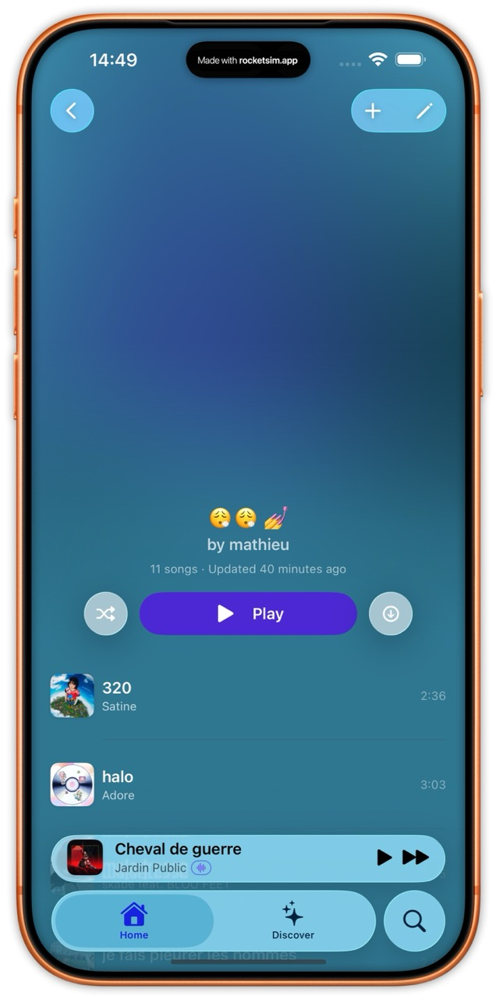
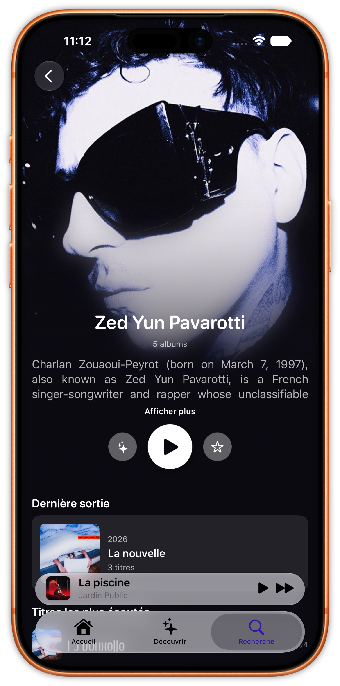

# Cassette

> A native iOS and macOS client for Subsonic, OpenSubsonic, and Navidrome servers. Built for people who self-host their music.

[](LICENSE)
[](https://github.com/CassetteLab/cassette/actions/workflows/release.yml)
[](#requirements)
[](https://swift.org)
[](https://discord.gg/zQxUQedpex)


---

## Screenshots

| Home | Album | Player | Playlist | Artist |
|------|-------|--------|----------|--------|
|  |  |  |  |  |

---

## What is Cassette?

Cassette is a native Swift / SwiftUI music client for iOS and macOS, built for people who run their own music server. It speaks the Subsonic and OpenSubsonic API, so it works with Navidrome and any other compliant server.

It's a pure streaming client for *your* library — no accounts, no subscriptions, no tracking. Your music stays between your device and your server. The iOS app is distributed via TestFlight; the macOS app ships as a notarized build through Homebrew.

Licensed under MPL-2.0.

---

## Features

**Listening**
- Native iOS 26 / macOS 15 client with a Liquid Glass design language
- Background playback with lock screen and Control Center controls, plus AirPlay
- True offline mode: download albums, playlists, or individual tracks
- Playback powered by the AudioStreaming engine — FLAC, MP3, AAC, WAV, and Ogg/Vorbis
- Persistent playback session — pick up where you left off after relaunching
- Lyrics support
- Shuffle, repeat, and full queue management

**Library**
- Browse by playlists, artists, albums, downloads, and favorites
- Pinned albums and playlists on the home screen
- Recently added (online) and recently downloaded (offline)
- Full-text search across your library
- Favorites synced with your server (star / unstar)
- **Cassette Wrapped** — a yearly recap of your listening

**Integrations & extras**
- **ListenBrainz** — scrobble your listens and surface recommendations (fresh releases, similar artists)
- **Home-screen widgets** (iOS)
- **Discord Rich Presence** — *experimental / pre-alpha*; shows your now-playing in Discord through the companion helper, [cassette-discord-rpc](https://github.com/MathieuDubart/cassette-discord-rpc)

**Server & privacy**
- Subsonic and OpenSubsonic API, with OpenSubsonic extensions where available
- Custom HTTP headers for servers behind a reverse proxy (Cloudflare Access, Authelia, etc.)
- Credentials stored only in the iOS / macOS Keychain — zero tracking, zero analytics, all traffic direct to your server

---

## Installation

### macOS — Homebrew

```bash
brew trust CassetteLab/cassette
brew tap CassetteLab/cassette
brew install --cask cassette
```

This installs the notarized `Cassette.app`.

### iOS — TestFlight

Join the beta: <https://testflight.apple.com/join/pxCpfpxF>

### Build from source

1. **Requirements**
   - macOS 15 or later with Xcode 26 or later
   - A Subsonic / OpenSubsonic / Navidrome server to connect to
   - An Apple Developer account (the free tier works for personal device builds)

2. **Clone and open**
   ```bash
   git clone https://github.com/MathieuDubart/cassette.git
   cd cassette
   open Cassette.xcodeproj
   ```
   Swift Package Manager resolves the dependencies (SwiftSonic and AudioStreaming) automatically — no extra setup.

3. **Sign and run**
   - Select your team in Signing & Capabilities
   - Choose an iOS 26+ device/simulator or **My Mac**
   - Build and run (⌘R)

4. **First launch**
   - Cassette prompts for your server URL, username, and password
   - If your server sits behind a reverse proxy that needs custom request headers, expand **Advanced** and add them
   - Tap **Connect** — Cassette verifies the connection and stores credentials in the Keychain

---

## Requirements

- iOS 26 or later, or macOS 15 (Sequoia) or later
- A running Subsonic, OpenSubsonic, or Navidrome server

---

## Server compatibility

Cassette works with any server that implements the Subsonic / OpenSubsonic API, and uses OpenSubsonic extensions where available. [Navidrome](https://www.navidrome.org) is the recommended and primary-tested server.

If your server implements the Subsonic API and something doesn't behave, [open an issue](https://github.com/MathieuDubart/cassette/issues).

---

## Architecture

For developers curious about the internals:

- **UI** — SwiftUI views with `@Observable @MainActor` view models; no business logic in views.
- **Services** — Swift actors (`PlayerService`, `LibraryService`, `DownloadService`, `FavoritesService`, `NowPlayingService`, …) with no SwiftUI / UIKit imports.
- **Playback** — the [AudioStreaming](https://github.com/dimitris-c/AudioStreaming) engine, wired to `MPNowPlayingInfoCenter` and `MPRemoteCommandCenter` for lock screen, Control Center, and AirPlay.
- **Subsonic API** — [SwiftSonic](https://github.com/MathieuDubart/swiftsonic) (same author, separate repo, MIT) handles all Subsonic / OpenSubsonic communication.
- **Persistence** — SwiftData for app data (downloads, playlists, favorites cache); Keychain for credentials.
- **Concurrency** — Swift 6 strict concurrency, `Sendable` throughout, `SWIFT_DEFAULT_ACTOR_ISOLATION = MainActor`.
- **Dependencies** — SwiftSonic and AudioStreaming (which brings Ogg/Vorbis binary frameworks for lossless decoding). That's the full list.

---

## Roadmap

Cassette is built incrementally, one theme per release.

- **v1.8 — Widgets** ✅ shipped
- **v2.0 — CarPlay** (in progress)

For the full roadmap and discussion, see [GitHub Discussions](https://github.com/MathieuDubart/cassette/discussions).

---

## Links & support

- Website — [getcassette.app](https://getcassette.app)
- Feedback / bug reports — [support@getcassette.app](mailto:support@getcassette.app) · [GitHub Issues](https://github.com/MathieuDubart/cassette/issues)
- Ideas & discussion — [GitHub Discussions](https://github.com/MathieuDubart/cassette/discussions)
- Support development — [Ko-fi](https://ko-fi.com/mathieudbrt)

---

## Contributing

Contributions are welcome. A few things before you start:

- **Discuss before coding** — open an issue or discussion before working on a feature, especially architectural changes. A PR that contradicts a design decision may be closed.
- **Match the existing style** — Swift 6 strict concurrency, no Foundation / UIKit leakage outside the service layer, dependencies kept minimal (SwiftSonic + AudioStreaming).
- **Test on real devices** — audio playback and Liquid Glass effects behave differently in the Simulator.
- **Conventional commits** — `feat`, `fix`, `refactor`, `docs`, `chore`, etc.

---

## License

Cassette is licensed under [MPL-2.0](LICENSE).

- You can use, study, modify, and redistribute the source.
- Modified files stay under MPL-2.0; you may combine them with proprietary code in a Larger Work.
- The distributed builds (Homebrew, TestFlight) are the same source, signed for convenience.

Dependencies: [SwiftSonic](https://github.com/MathieuDubart/swiftsonic) (MIT) and [AudioStreaming](https://github.com/dimitris-c/AudioStreaming) by Dimitris C. (MIT) — both compatible with MPL-2.0.

> Code prior to commit 21f9227 was licensed under GPL-3.0-or-later.

---

## Acknowledgments

- The [Navidrome](https://www.navidrome.org) team for an excellent self-hosted music server
- The [OpenSubsonic](https://opensubsonic.netlify.app) community for modernizing the Subsonic API
- Substreamer, Ultrasonic, and Symfonium for raising the bar on what a self-hosted music client should feel like

---

Built by [Mathieu Dubart](https://github.com/MathieuDubart).

## Star History

<a href="https://www.star-history.com/?repos=Mathieudubart%2FCassette&type=timeline&legend=top-left">
 <picture>
   <source media="(prefers-color-scheme: dark)" srcset="https://api.star-history.com/chart?repos=Mathieudubart/Cassette&type=timeline&theme=dark&legend=top-left" />
   <source media="(prefers-color-scheme: light)" srcset="https://api.star-history.com/chart?repos=Mathieudubart/Cassette&type=timeline&legend=top-left" />
   
 </picture>
</a>
