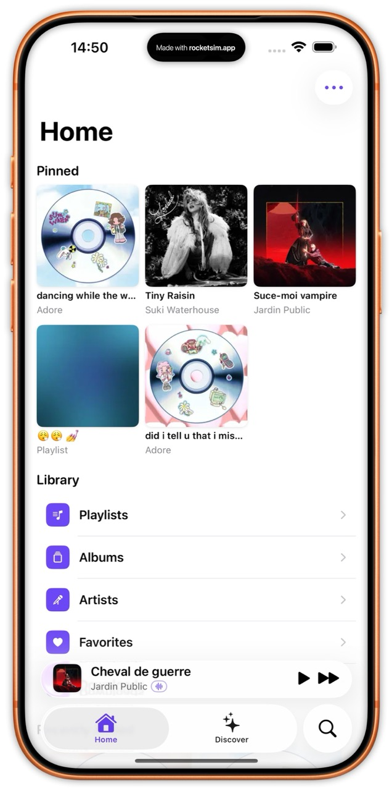
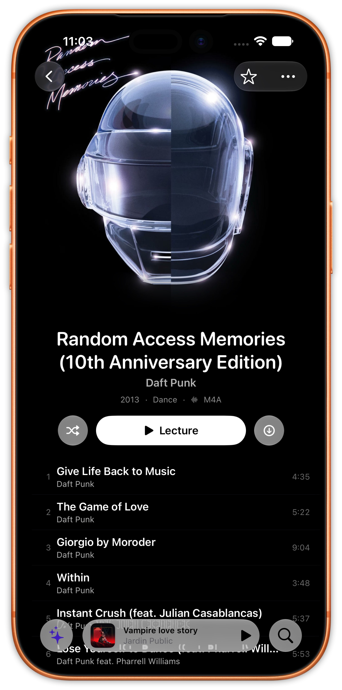
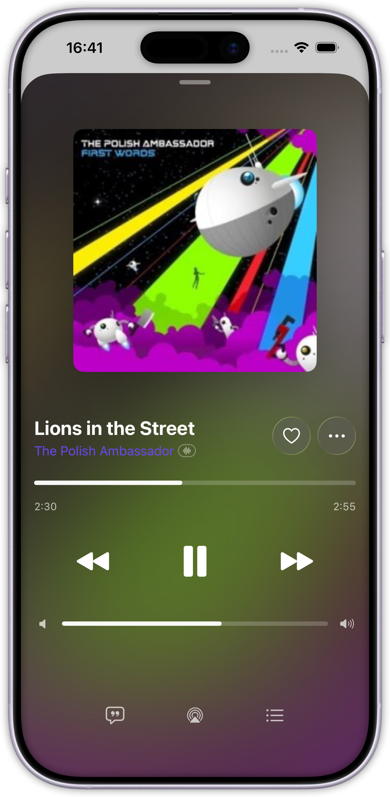

# Cassette

> A native iOS and macOS client for Subsonic, OpenSubsonic, and Navidrome servers. Built for people who self-host their music.

[](LICENSE)
[](#requirements)
[](https://swift.org)

---

## Screenshots

| Home | Album | Player |
|------|-------|--------|
|  |  |  |

---

## What is Cassette?

Cassette is a native Swift / SwiftUI music client for iOS and macOS, designed for people who run their own music server. It speaks the Subsonic and OpenSubsonic API, which means it works with Navidrome, Gonic, Airsonic Advanced, and any other compliant server. It is iOS-first — macOS support is minimal in v1.0 and will improve around v1.9

No accounts, no subscriptions, no tracking. Your music stays between your device and your server.

Licensed under MPL-2.0.

---

## Features

**Listening**
- Native iOS 26+ client with Liquid Glass design language
- Background playback with lock screen controls and AirPlay support
- True offline mode: download albums, playlists, or individual tracks
- Persistent playback session — pick up where you left off after relaunching
- Lyrics support, audio format display (FLAC / MP3 / AAC / WAV)
- Shuffle, repeat, and queue management

**Library**
- Browse by playlists, artists, albums, downloads, and favorites
- Pinned albums and playlists on the home screen
- Recently added (online) and recently downloaded (offline)
- Full-text search across your entire library
- Favorites synced with your server (star / unstar)

**Server compatibility**
- Subsonic API v1.16.1
- OpenSubsonic API extensions where available
- Custom HTTP headers support for servers behind reverse proxies (Cloudflare Access, Authelia, etc.)
- Ephemeral track cache to reduce repeated network requests

**Privacy**
- Zero tracking, zero analytics, zero third-party SDKs
- Credentials stored exclusively in the iOS / macOS Keychain
- All communication is directly between your device and your server

---

## Requirements

- iOS 26 or later (iPhone)
- macOS 14 or later (minimal support in v1.0)
- A running Subsonic, OpenSubsonic, or Navidrome server

---

## Installation

### Via the App Store

Coming soon.

### Via TestFlight (beta)

Coming soon.

### Building from source

If you prefer to build yourself:

1. **Requirements**
   - macOS 14+ with Xcode 16+
   - iOS 26+ deployment target
   - A Subsonic / OpenSubsonic / Navidrome server to connect to
   - An Apple Developer account (free tier works for personal device builds)

2. **Clone and build**
   ```bash
   git clone https://github.com/MathieuDubart/Cassette.git
   cd Cassette
   open Cassette.xcodeproj
   ```
   Swift Package Manager resolves the only dependency ([SwiftSonic](https://github.com/MathieuDubart/SwiftSonic)) automatically — no additional setup required.

3. **Sign and run**
   - Select your team in Signing & Capabilities
   - Choose a target device running iOS 26+
   - Build and run (⌘R)

4. **First launch**
   - Cassette prompts for your server URL, username, and password
   - If your server sits behind a reverse proxy requiring custom request headers, expand **Advanced** and add them
   - Tap **Connect** — Cassette verifies the connection and stores credentials securely
   - Your library appears immediately

---

## Server compatibility

Cassette implements the Subsonic API spec with OpenSubsonic extensions where available.

| Server | Status | Notes |
|--------|--------|-------|
| Navidrome | ✅ Recommended | Full feature support |
| Gonic | ✅ Tested | Full feature support |
| Airsonic Advanced | ✅ Tested | Full feature support |
| Funkwhale (subsonic-api plugin) | ⚠️ Untested | Should work |
| Ampache (Subsonic mode) | ⚠️ Untested | Should work |

If your server implements the Subsonic API and Cassette doesn't work correctly, [open an issue](https://github.com/MathieuDubart/Cassette/issues).

---

## Architecture

For developers curious about the internals:

- **UI layer**: SwiftUI views with `@Observable @MainActor` ViewModels. No business logic in views.
- **Service layer**: Swift actors for `PlayerService`, `LibraryService`, `DownloadService`, `FavoritesService`, and others. Zero UIKit / SwiftUI imports inside services.
- **SwiftSonic**: the underlying Swift library handling all Subsonic / OpenSubsonic API communication. Same author, separate repo, MIT-licensed. See [SwiftSonic](https://github.com/MathieuDubart/SwiftSonic).
- **Persistence**: SwiftData for app data (downloaded tracks, playlists, favorites cache); Keychain for credentials — no plaintext written to disk.
- **Playback**: AVFoundation, wired to `MPNowPlayingInfoCenter` and `MPRemoteCommandCenter` for lock screen, Control Center, and AirPlay.
- **Concurrency**: Swift 6 strict concurrency, `Sendable` throughout, `SWIFT_DEFAULT_ACTOR_ISOLATION=MainActor`.
- **Zero external dependencies**: the only dependency is SwiftSonic itself.

---

## Roadmap

Cassette is built incrementally, one theme per release.

- **v1.8** — Widgets
- **v2.0** — Carplay

For the full roadmap and discussion, see [GitHub Discussions](https://github.com/MathieuDubart/Cassette/discussions).

---

## Contributing

Contributions are welcome. A few things to keep in mind before you start:

- **Discuss before coding**: open an issue or a discussion before working on a feature, especially for architectural changes. A PR that contradicts a design decision will be closed.
- **Match the existing style**: Swift 6 strict concurrency, no external dependencies beyond SwiftSonic, no Foundation / UIKit leakage outside the service layer.
- **Test on real devices**: audio playback and Liquid Glass effects behave differently in Simulator — real device testing is expected.
- **Conventional commits**: `feat`, `fix`, `refactor`, `docs`, `chore`, etc.

For bug reports: [Issues](https://github.com/MathieuDubart/Cassette/issues).
For ideas and feedback: [Discussions](https://github.com/MathieuDubart/Cassette/discussions).

---

## License

Cassette is licensed under [MPL-2.0](LICENSE).

- You can use, study, modify, and redistribute the source code
- Modified files must remain under MPL-2.0; you may combine them with proprietary code in a Larger Work
- The App Store version is the same code, signed and distributed for convenience

The underlying [SwiftSonic](https://github.com/MathieuDubart/SwiftSonic) library is MIT-licensed, which is compatible with MPL-2.0.

> Code prior to commit 21f9227 was licensed under GPL-3.0-or-later.

---

## Acknowledgments

- The [Navidrome](https://www.navidrome.org) team for an excellent self-hosted music server
- The [OpenSubsonic](https://opensubsonic.netlify.app) community for modernizing the Subsonic API spec
- The Substreamer, Ultrasonic, and Symfonium Android apps for raising the bar on what a self-hosted music client should feel like

---

Built by [Mathieu Dubart](https://github.com/MathieuDubart).
